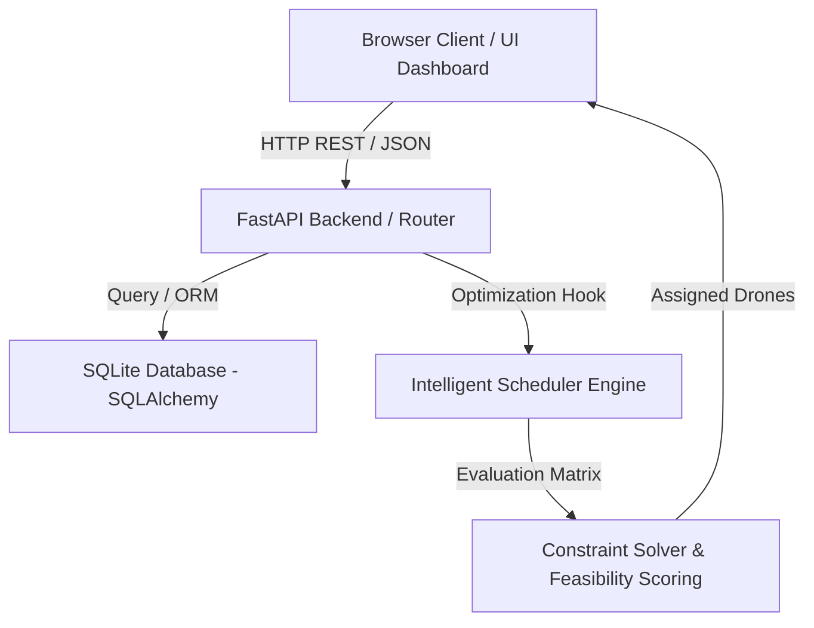

# DroneMind

Intelligent Multi-Drone Fleet Intelligence & Dynamic Mission Optimization Platform.

---

## Overview

**DroneMind** is a state-of-the-art B2B multi-tenant drone fleet intelligence and constraint-aware mission optimization command center. Built for the Smart India Hackathon (SIH), it demonstrates real-time decision-making systems required for autonomous logistics, delivery routing, and dispatch operations. 

Using mathematical optimization and live simulation parameters, DroneMind supports strict multi-tenant isolation, real-time drone health telemetry, and automatic re-routing logic for drone failures.

---

## Architecture Diagram



---

## Features

1. **Passwordless SIH Demo Login:**
   - Instantly access the app via role toggles: `LOGIN AS ADMIN` or `LOGIN AS USER`.
   - Prevents demo authentication lockouts.
2. **Multi-Tenant Separation:**
   - Administrative command oversight vs. organization-scoped dashboards (e.g. *Cloud Kitchen*).
3. **Constraint-Aware Fleet Optimization:**
   - Dynamic 100-point feasibility scoring evaluating:
     - Battery health and limits.
     - Payload weight matching capacity.
     - Maximum range thresholds.
     - Deadline priorities.
4. **Dynamic Re-Optimization Simulator:**
   - Fail a drone mid-mission to auto-compute the mathematically optimal next-in-line available replacement.
5. **Live Map & Interactive Control Panels:**
   - Integrated Leaflet / OpenStreetMap visual overlays representing active drone telemetries.

---

## Technology Stack

- **Frontend:** Vanilla JS, Tailwind/Custom CSS, Leaflet Maps, Chart.js.
- **Backend:** Python, FastAPI, SQLAlchemy ORM, Uvicorn Server.
- **Database:** SQLite (Relational, isolated via `organization_id` foreign keys).
- **Optimization:** Pure Python math constraint solver model.

---

## Demo Guidelines

### 👑 Scenario A: Platform Admin Role
1. Click **`LOGIN AS ADMIN`**.
2. View global statistics across all business organization tenants (e.g., QuickCart, MediExpress).
3. Monitor global maps, alerts, and platform fleet analytics charts.

### 🍕 Scenario B: Business User Role
1. Click **`LOGIN AS USER`** (scoped to Cloud Kitchen).
2. Go to **`Delivery Orders`** and click **`New Delivery Order +`** to queue a task.
3. Open **`Optimization Center`** and click **`RUN OPTIMIZATION`** to trigger the 100-point constraint solver.
4. Go to **`Simulation`** -> select **`D-02 (On Mission)`** -> click **`SIMULATE FAILURE`** to watch the platform auto-trigger, routing the task dynamically to the next best match (e.g. `D-01`).

---

## Local Setup & Launch

Follow these steps to run the self-contained launcher locally:

### 1. Clone & Enter Project Folder
```bash
git clone https://github.com/your-username/dronemind.git
cd dronemind
```

### 2. Setup Virtual Environment
```bash
# Windows
python -m venv venv
venv\Scripts\activate

# macOS / Linux
python3 -m venv venv
source venv/bin/activate
```

### 3. Install Dependencies
```bash
pip install -r requirements.txt
```

### 4. Create local Env config
Copy `.env.example` to `.env`.

### 5. Launch Application
Start the unified application (FastAPI serves both the API endpoints and the frontend files at root `/`):
```bash
python -m uvicorn backend.main:app --host 0.0.0.0 --port 8000
```

### 6. View Command Center
Open your web browser and navigate to:
👉 **[http://localhost:8000](http://localhost:8000)**
